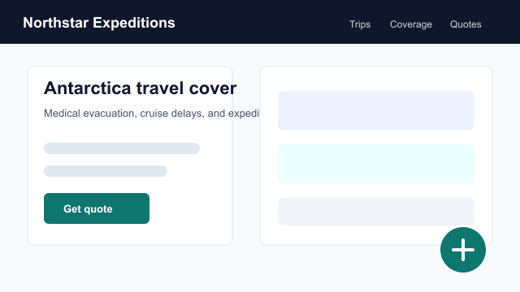
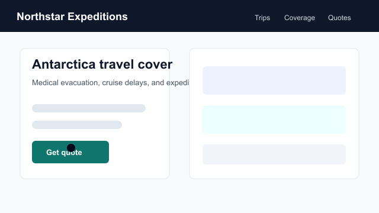
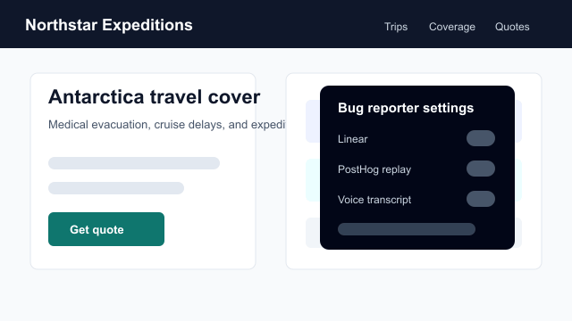

# @alunsoldantarctica/bug-reporter

Adapter-first bug reporter for product/admin apps.

It packages the flow Expedition Insure uses internally:

- a floating public-site reporter
- an admin/header report button
- optional element picking and screenshot upload
- optional microphone narration
- optional PostHog session replay linking
- Linear issue filing through a server adapter

The package is intentionally backend-agnostic. The browser collects report
context; your server owns auth, secrets, ticket creation, storage, and any
privacy policy decisions.

## Feature Walkthrough

The GIFs below use a plausible expedition-insurance site mock so the behavior is
clear without exposing a production customer surface.

### Floating Reporter

The launcher opens into a report form, can start a recording, links PostHog when
available, and submits to your configured endpoint.



### Element Picker

The picker records the affected selector and can send an element screenshot as
an attachment.



### Optional Integrations

Linear, PostHog, and voice transcription are independent switches. Secrets stay
server-side.



## Install

```sh
npm install @alunsoldantarctica/bug-reporter
```

Peer dependencies:

```sh
npm install react react-dom
```

## Client Usage

Use the HTTP adapter when your app submits reports to a route such as
`/api/bug-report`.

```ts
import { createHttpBugReportAdapter } from "@alunsoldantarctica/bug-reporter";

const bugReporter = createHttpBugReportAdapter("/api/bug-report");

await bugReporter.submit({
  source: "site",
  surface: window.location.pathname,
  url: window.location.href,
  message: "The quote button is disabled after changing dates.",
  severity: "medium",
  userAgent: navigator.userAgent,
  replaySessionId: window.posthog?.get_session_id?.(),
});
```

When the payload includes files, the adapter automatically sends
`multipart/form-data`. Otherwise it sends JSON.

## Astro on Cloudflare Workers

Add an API route:

```ts
// src/pages/api/bug-report.ts
import type { APIRoute } from "astro";
import { createAstroCloudflareBugReportHandler } from "@alunsoldantarctica/bug-reporter";

export const prerender = false;

export const POST: APIRoute = async ({ request, locals }) => {
  const handle = createAstroCloudflareBugReportHandler({
    env: locals.runtime.env,
    requireAuth: (req) => Boolean(req.headers.get("cookie")?.includes("staff_session=")),
  });

  return handle(request);
};
```

The included example lives at
`examples/astro-cloudflare/src/pages/api/bug-report.ts`.

## GitHub Pages Demo

Yes, GitHub Pages can host a try-it page for the floating reporter.

Use it for browser-only behavior:

- opening the launcher
- filling a report
- selecting visual elements
- showing optional replay/voice toggles
- submitting through a mock adapter

Do not put production API keys on `github.io`. GitHub Pages is static hosting,
so Linear and AI Gateway calls must go through a real server route such as a
Cloudflare Worker.

This package includes a static mock demo:

`docs/demo/index.html`

For a public docs site, publish that folder with GitHub Pages. The production
version should swap the mock submit handler for:

```ts
createHttpBugReportAdapter("https://your-worker.example.com/api/bug-report")
```

## Example Workflow

This is the intended product loop for an Astro site running on Cloudflare
Workers.

### 1. Staff Sees the Reporter on Public Pages

Render the launcher on every public page, but gate visibility to authenticated
staff/admin users. Anonymous visitors never download or see the reporter UI.

Typical checks:

- staff session cookie exists
- signed-in role is `admin` or `staff`
- optional local role hint to avoid loading the bundle for anonymous traffic

### 2. Reporter Selects Visual Elements

The reporter clicks "pick element", then selects the broken UI on the page.
Capture:

- CSS selector
- visible text
- outer HTML, capped/redacted by the host app
- bounding rect and viewport size
- optional element screenshot

That context matters because a bug report like "button broken" becomes
"button broken on `/quote`, selector `.operator-card[data-slug=quark]`, visible
text `Quark Expeditions`, viewport 390x844."

### 3. Reporter Adds Optional Replay and Voice

Optional additions:

- PostHog replay session id, when PostHog is present
- microphone narration, converted to WAV client-side
- voice transcript, generated server-side through Cloudflare AI Gateway

All optional features degrade independently. A missing mic permission should not
block ticket creation.

### 4. Server Creates the Linear Ticket

The Astro route receives JSON or multipart form data, checks staff auth, files a
Linear issue, uploads attachments to Linear, and adds replay/transcript links.

The resulting ticket has:

- page URL and surface
- selected element metadata
- screenshot/audio attachments
- PostHog replay URL when configured
- severity and source

### 5. Claude Code Enriches the Ticket

After Linear creation, run a Claude Code routine that reads the ticket and adds
codebase context before a person or agent implements it.

Routine example:

`examples/claude-code/linear-bug-context-routine.md`

Suggested automation:

1. Linear webhook fires when a new bug-reporter issue is created.
2. Worker/GitHub Action starts Claude Code in the repo.
3. Routine fetches Linear issue details and attachments.
4. Routine searches the codebase for matching routes, text, selectors, testids,
   API calls, and analytics events.
5. Routine posts a concise Linear comment with likely owning files,
   reproduction path, first hypothesis, and suggested tests.

Example enriched ticket comment:

```md
Likely owning surface:
- `src/pages/quote.astro`
- `src/components/react/QuoteWizard.tsx`
- `src/components/react/quote-wizard/Step3Operator.tsx`

Why:
- Reported URL is `/quote`.
- Picked selector points to the operator card grid.
- Visible text matches the operator selection step.
- Replay should confirm whether state resets after date changes.

First hypothesis:
Changing dates resets wizard state and clears selected operator before submit.

Suggested tests:
- Unit test for date changes preserving selected operator.
- Playwright path covering destination, dates, operator, back, date edit, submit.

Confidence: medium. Need replay check before implementation.
```

## Cloudflare Bindings

Required for Linear filing:

```txt
LINEAR_API_TOKEN
```

Optional:

```txt
LINEAR_TEAM_KEY=EXP
LINEAR_LABELS=bug
POSTHOG_PROJECT_ID=12345
POSTHOG_HOST=https://us.posthog.com
AI_GATEWAY_URL=https://gateway.ai.cloudflare.com/v1/<account>/<gateway>
AI_GATEWAY_TOKEN=<cloudflare-ai-gateway-token>
```

`AI_GATEWAY_URL` and `AI_GATEWAY_TOKEN` enable audio transcription through Groq
Whisper via Cloudflare AI Gateway. The package never sends provider API keys to
the browser.

## What the Astro Adapter Does

`createAstroCloudflareBugReportHandler`:

1. optionally runs your `requireAuth` function
2. accepts JSON or multipart submissions
3. creates a Linear issue
4. formats a PostHog replay URL when `replaySessionId` and `POSTHOG_PROJECT_ID`
   are present
5. uploads audio/images to Linear as issue comments
6. transcribes audio best-effort when AI Gateway env vars are present

Attachment upload and transcription failures throw for now. Wrap the handler or
provide a custom adapter if your product must file the issue even when
attachments fail.

## Security Model

Do not expose ticketing or transcription keys to the browser.

Recommended setup:

- gate the route with your staff/admin session
- redact sensitive fields before ticket creation
- keep `LINEAR_API_TOKEN` and `AI_GATEWAY_TOKEN` in Cloudflare secrets
- only enable PostHog replay links for trusted internal reporters
- disclose microphone recording in your product UI

The package provides plumbing; the host app remains responsible for consent,
retention, authorization, and PII handling.

## Public API

```ts
createHttpBugReportAdapter(endpoint?: string)
createAstroCloudflareBugReportHandler(options)
pickAudioMime()
blobToWav(blob)
formatRecordingTime(seconds)
```

Core types:

```ts
BugReportPayload
BugReportResult
BugReportAdapter
BugReportFile
CapturedElement
PostHogLike
```

## Publishing

This package is public-npm ready:

```sh
pnpm exec tsc -p apps/bug-reporter/tsconfig.json
npm publish --access public
```
